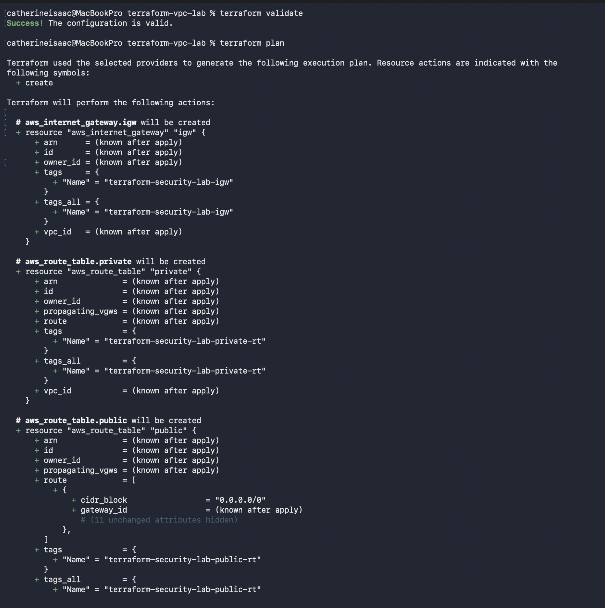
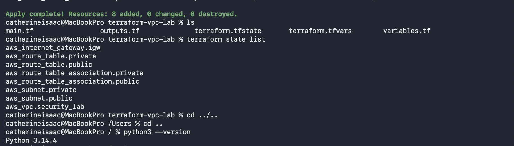
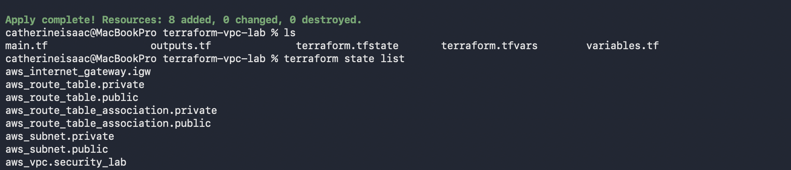

# AWS Secure VPC with Terraform

Security-focused AWS networking lab demonstrating VPC segmentation, Infrastructure as Code with Terraform, and cloud infrastructure auditing with Python/Boto3.

## Architecture

The environment consists of:

- VPC — `10.20.0.0/16`
- Public subnet — `10.20.1.0/24`
- Private subnet — `10.20.2.0/24`
- Internet Gateway
- Separate public and private route tables
- Amazon Linux EC2 instance for connectivity testing
- Security group restricting SSH (`22`) to an approved source IP

The VPC networking layer was provisioned with Terraform. The EC2 instance and security group were configured separately as part of the broader AWS security lab.

## Technologies

`AWS` · `Terraform` · `Python` · `Boto3` · `Linux` · `Git`

## Terraform Infrastructure

Terraform managed eight AWS networking resources:

```text
aws_vpc.security_lab
aws_internet_gateway.igw
aws_subnet.public
aws_subnet.private
aws_route_table.public
aws_route_table.private
aws_route_table_association.public
aws_route_table_association.private
```

The infrastructure was successfully validated, planned, deployed, verified through Terraform state, and destroyed after testing.

## Security Controls

- Public/private subnet segmentation
- Separate routing for public and private network tiers
- Internet Gateway route limited to the public subnet
- SSH restricted to an approved source IP
- Terraform state and `.tfvars` excluded from Git
- Credentials and private keys excluded from the repository
- Infrastructure reviewed with `terraform plan` before deployment

## Python VPC Audit

`scripts/vpc_audit.py` uses Boto3 to programmatically inspect the AWS VPC environment, adding an automated validation layer to the Terraform workflow.

## Evidence

### Validate & Plan

Terraform successfully validated the configuration and generated the infrastructure plan.



### Deploy & Verify

Terraform successfully created all eight managed resources, followed by state verification.



### Destroy & Verify

All eight Terraform-managed resources were destroyed after testing, and the state was verified afterward.



## Workflow

```text
Design
  ↓
Terraform Validate
  ↓
Terraform Plan
  ↓
Terraform Apply
  ↓
State Verification
  ↓
Python/Boto3 Audit
  ↓
Terraform Destroy
```

## Key Takeaways

This project strengthened my practical understanding of AWS VPC architecture, subnetting, routing, Terraform state management, Infrastructure as Code, and Python-based cloud infrastructure auditing.

The Terraform configuration remains reproducible even after the deployed infrastructure is destroyed.

---

**Catherine Isaac**  
Security Engineering | Cloud Security | Infrastructure Security
